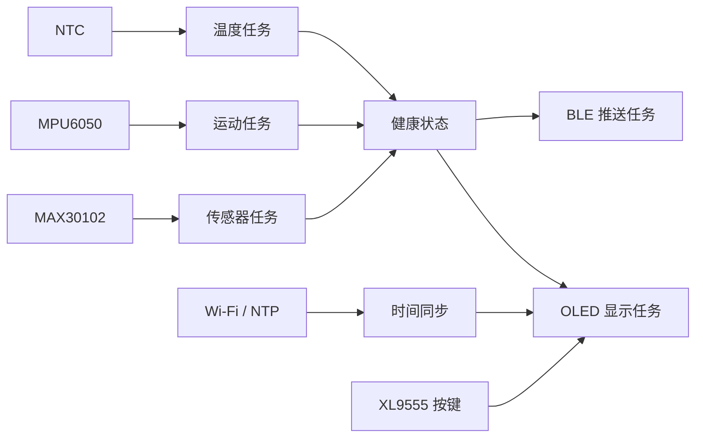

<div align="center">

# HealthWatch ESP32-S3 Firmware

**一套面向智能健康手环原型的 ESP-IDF 固件**

心率与血氧 · 体温 · 计步 · OLED · BLE · Wi-Fi/NTP

[](https://github.com/espressif/esp-idf)
[](https://www.espressif.com/en/products/socs/esp32-s3)
[](LICENSE)

</div>

> [!IMPORTANT]
> 本项目用于学习、课程设计和硬件原型验证，不是医疗器械。测量结果不能用于诊断、治疗或紧急救援决策。

## 项目简介

HealthWatch 将多个传感器与 ESP32-S3 组合为一个可运行的智能手环固件原型。系统使用 FreeRTOS 多任务分别采集健康数据、刷新 OLED、同步时间并通过 BLE 推送数据。

### 已实现功能

- MAX30102 心率、血氧采集与佩戴检测
- MPU6050 姿态采集与计步
- NTC 温度采集、均值滤波与温度状态判断
- 1.3 英寸 SH1106 OLED 时间和健康数据界面
- BLE 二进制健康数据通知
- Wi-Fi 联网与 NTP 北京时间同步
- XL9555 扩展按键切换显示模式及告警页面
- 摔倒检测模块（代码已包含，默认主任务尚未启用）

## 系统结构



## 硬件与接线

当前代码中的默认引脚如下。更换开发板或原理图时，请同步修改对应模块头文件。

| 模块 | 接口 | ESP32-S3 引脚 / 地址 |
| --- | --- | --- |
| MAX30102 | I²C1 SDA / SCL | GPIO18 / GPIO19，地址 `0x57` |
| MPU6050 | 软件 I²C SDA / SCL | GPIO15 / GPIO16，地址 `0x68` |
| SH1106 OLED | 软件 I²C SDA / SCL | GPIO4 / GPIO5，地址 `0x3C` |
| XL9555 | I²C0 SDA / SCL | GPIO41 / GPIO42，地址 `0x20` |
| NTC 模拟量 | ADC1 Channel 5 | 具体 GPIO 由 ESP32-S3 ADC 映射决定 |
| NTC 数字告警 | GPIO | GPIO7 |
| 模式按键 | XL9555 | IO1_7 |
| 告警按键 | XL9555 | IO1_6 |

> 所有模块必须共地，并确认供电电压与模块规格一致。MAX30102、MPU6050 和 OLED 使用了不同的软件/硬件 I²C 实现，请按代码中的总线定义接线。

## 环境要求

- ESP-IDF 5.4.x（仓库锁文件记录为 5.4.0）
- Python 与 CMake：使用 ESP-IDF 安装器自带版本
- 一块 ESP32-S3 开发板
- USB 数据线及上述传感器模块

## 快速开始

### 1. 获取代码

```bash
git clone https://github.com/Pigpig22/ESP32.git
cd ESP32
```

### 2. 初始化 ESP-IDF 环境

按你的 ESP-IDF 安装位置执行导出脚本：

```bash
. "$IDF_PATH/export.sh"
```

### 3. 选择芯片并配置 Wi-Fi

```bash
idf.py set-target esp32s3
idf.py menuconfig
```

进入 `HealthWatch configuration`，填写用于 NTP 同步的 Wi-Fi 名称和密码。配置只写入本地 `sdkconfig`，该文件已被 Git 忽略。

Wi-Fi 不是健康数据采集和 BLE 的必要条件；留空时需要根据实际使用场景决定是否禁用联网初始化。

### 4. 编译、烧录和监视

```bash
idf.py build
idf.py -p /dev/ttyUSB0 flash monitor
```

macOS 端口通常类似 `/dev/cu.usbmodem*`，Windows 通常为 `COMx`。退出串口监视器：`Ctrl+]`。

## OLED 显示模式

- 正常模式：时间、日期、星期和步数
- 健康模式：心率、血氧与温度
- 告警页面：通过 XL9555 告警按键触发
- 心率/血氧传感器预热或未佩戴时，界面会显示对应状态

## BLE 数据协议

固件每 2 秒发送一个紧凑二进制数据包：

| 偏移 | 类型 | 字段 | 说明 |
| ---: | --- | --- | --- |
| 0 | `uint8_t` | `hr` | 心率，单位 BPM |
| 1 | `uint8_t` | `spo2` | 血氧，单位 % |
| 2 | `int8_t` | `temp` | 四舍五入后的温度，单位 ℃ |
| 3–4 | `uint16_t` | `step` | 步数，ESP32 小端序 |

总长度为 5 字节。手机端解析步数时应按小端序读取。

## 目录结构

```text
.
├── main/
│   ├── main.c                  # 应用入口与 FreeRTOS 任务
│   └── idf_component.yml       # ESP-IDF 组件依赖
├── components/BSP/
│   ├── BLE/                    # BLE 服务与通知
│   ├── MAX30102/               # 心率/血氧
│   ├── MPU6050/                # 姿态与计步
│   ├── NTC/                    # 温度
│   ├── OLED/                   # SH1106 显示
│   ├── WIFI/                   # Wi-Fi 与 NTP
│   ├── XL9555/                 # IO 扩展
│   ├── EXIT_KEY/               # 按键与显示模式
│   └── FALL_DETECT/            # 摔倒检测模块
└── partition-16MiB.csv         # 16 MiB Flash 分区表示例
```

## 已知限制

- 传感器阈值和 NTC 参数与具体硬件、佩戴方式有关，使用前需要校准。
- 摔倒检测模块目前没有加入 `app_main` 的默认任务列表。
- 健康数据缓存与有效范围属于原型算法，不能替代医学级算法。
- 当前 BLE 数据包没有版本字段；扩展协议时建议先增加协议版本。

## 安全与隐私

仓库不应包含真实 Wi-Fi 密码、令牌或个人健康数据。提交前请查看 [SECURITY.md](SECURITY.md)。如果你曾经把真实凭据提交到 Git 历史，请立即轮换凭据；仅删除当前文件中的字符串并不能让历史记录失效。

## 参与贡献

欢迎提交 Issue 和 Pull Request。开始前请阅读 [CONTRIBUTING.md](CONTRIBUTING.md)。

## License

本项目采用 [MIT License](LICENSE)。
